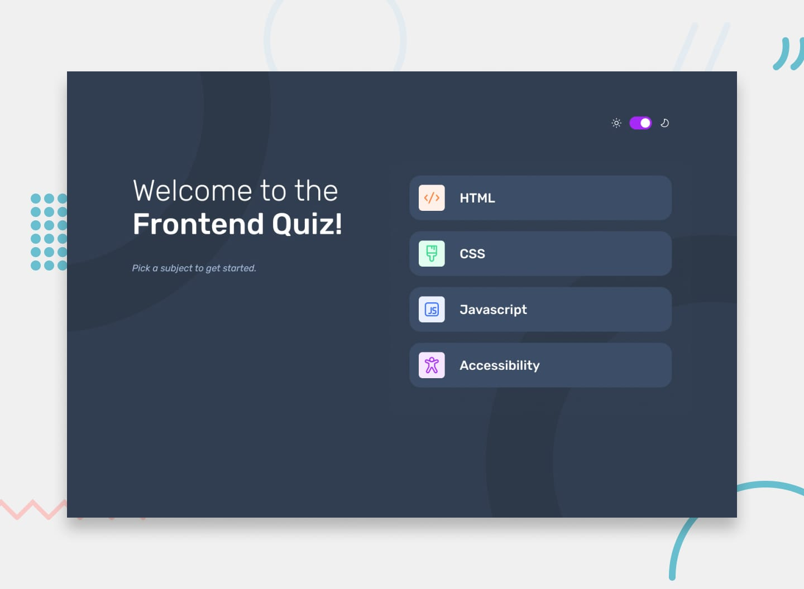

# Frontend Mentor - Frontend quiz app

## The challenge

We provide the data in a local `data.json` file, so use that to populate the content for the quizzes.

## Your users should be able to:

### Logic

1. Select a quiz subject
2. Select a single answer from each question from a choice of four
3. See an error message when trying to submit an answer without making a selection
4. See if they have made a correct or incorrect choice when they submit an answer
5. Move on to the next question after seeing the question result
6. See a completed state with the score after the final question
7. Play again to choose another subject

### Layout & Styles

1. View the optimal layout for the interface depending on their device's screen size
2. See hover and focus states for all interactive elements on the page
3. Navigate the entire app only using their keyboard
4. **Bonus**: Change the app's theme between light and dark
